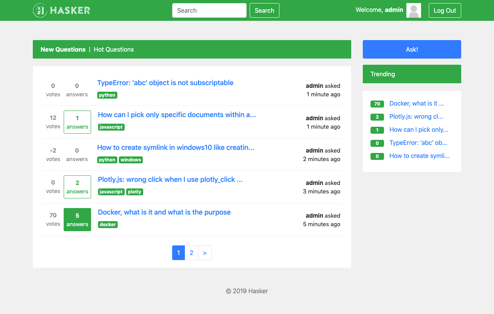
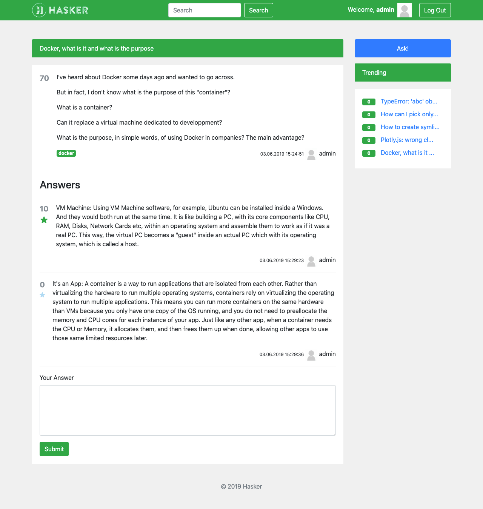

# Homework 06: Django Project

## Hasker: Poor Man's Stackoverflow

Simplified Q&A clone of stackoverflow.com written in Python and based on Django.

**Features:**

- Asking question and optionally tagging it with up to 3 tags
- Answering question
- Receiving email notifications when questions are getting new answers
- Marking answers as best
- Voting for questions and answers
- Viewing newest and most rated questions
- Searching for questions by phrase or tag
- New user registration
- Uploading profile photo

**Pages:**

- `/` — Index / New questions
- `/hot/` — Hot questions
- `/add/` — Ask question
- `/<id>/` Question details
- `/search/?q=<search_text>` — Search question
- `/tag/<tag_name>/` — Search tag
- `/user/signup/` — Sign up
- `/user/login/` — Log in
- `/user/settings/` — User settings
- `/admin/` — Admin

**API:**

- `/api/schema/` — API Schema
- `/api/question/` — Question list
- `/api/question/trending/` — Trending questions
- `/api/question/search/?q=<search text>` — Search question
- `/api/question/<id>/answer/` — Question answers
- `/api/user/` — User list
- `/api/user/obtain_token/` — Get user token
- `/api/user/refresh_token/` — Refresh user token
- `/api/user/verify_token/` — Verify user token


### Screenshots






### Requirements

- Python 3.x
- PostgreSQL


### Environment variables

Create `.env` file in project root directory (use [env.example](env.example) as a template):

```bash
cat > .env << END
...
END
```

| Variable          | Type   | Description |
| ---------------- | :----: | --- |
| POSTGRES_DB       | string | Database name |
| POSTGRES_USER     | string | Database user name |
| POSTGRES_PASSWORD | string | Database user password |
| POSTGRES_HOST     | string | Database host |
| POSTGRES_PORT     | int    | Database port |
| DEBUG             | bool   | Django debug mode |
| SECRET_KEY        | string | Django secret key ([generator](https://djecrety.ir/)) |


### Run locally

Install dependencies:

```bash
pip install -r requirements.txt
```

Make migrations:

```bash
./manage.py makemigrations
./manage.py migrate
```

Start server for your REST-API:

```bash
./manage.py runserver 127.0.0.1:8050
```


### Build and run in single Docker container

Start container:

```bash
docker pull centos
docker run -it --rm -p 8000:80 centos /bin/bash
```

Prepare:

```bash
yum clean all
yum install -y git make
git clone https://github.com/dmryutov/otus-python-0319.git projects/otus
cd projects/otus/hw6
```

Build project:

```bash
chmod +x build.sh
make prod
```


### Run in multiple Docker containers

```bash
docker-compose up -d --build
```


### Testing

```bash
python3 manage.py test -k
```